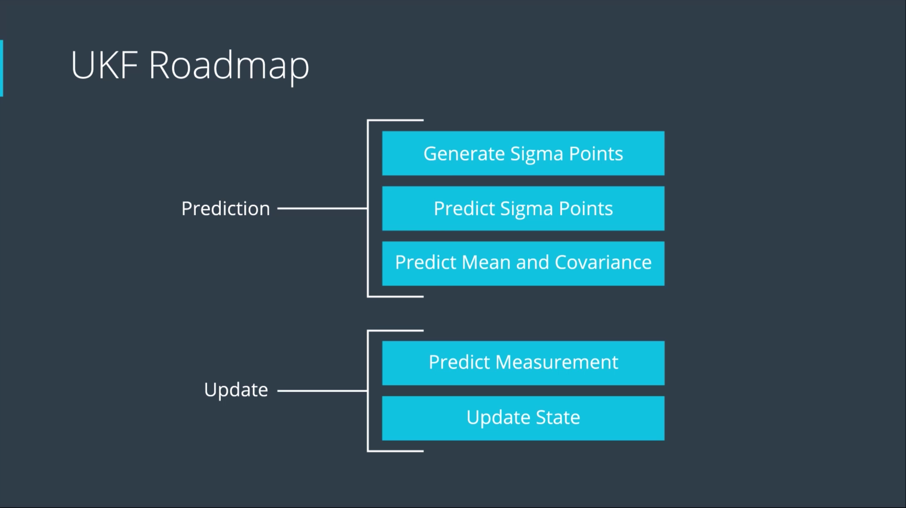
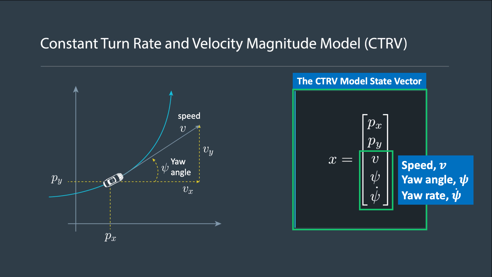
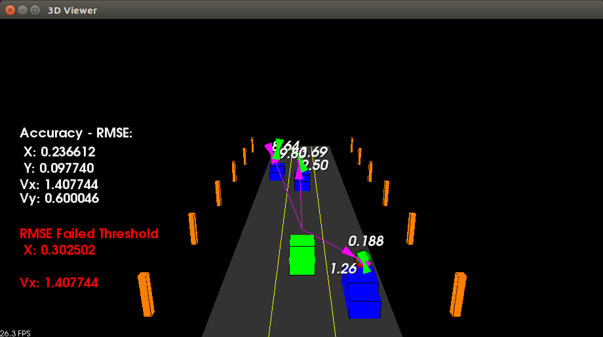
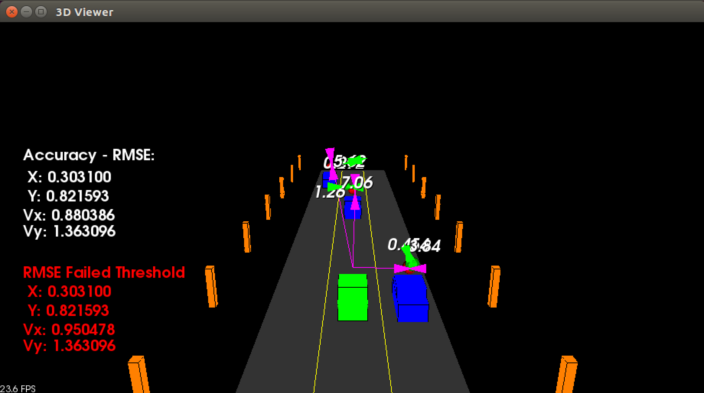
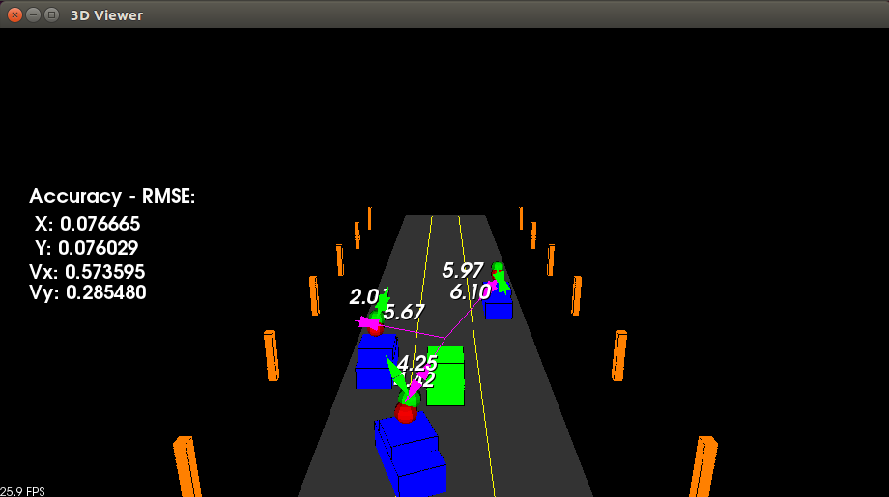
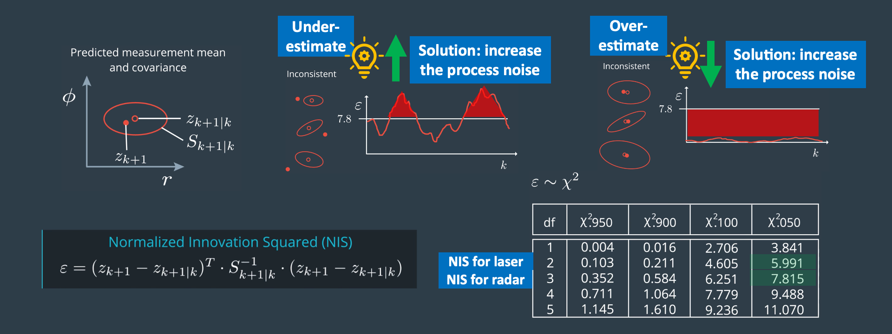

# SFND_Unscented_Kalman_Filter
Sensor Fusion UKF Highway Project

## Unscented Kalman Filter

### Why use *Unscented Kalman Filter* ?

- **Able to take noisy measurement data** as input and provide a smooth position and velocity estimation of dynamic objects around you without introducing a delay

- **Can provide an estimation of the orientation and the yaw rate of other vehicles** using sensors that can't even directly observe these things

- **Gives information on how precise the result is** because it always provides a covariance matrix for every estimation. This covariance matrix is realistic if the UKF performs a consistency check. 

### Limitations of UKF, they are not suitable for:

- tracking object *that has non-uniform turn rate*
- tracking object *that has high yaw rate*


In this project, an Unscented Kalman Filter (UKF) is implemented to estimate the state of multiple cars on a highway using noisy lidar and radar measurements using CTRV (constant turn-rate velocity model). To evaluate the performance of this project, **RMSE threshold values [X, Y, Vx, Vy]** are used to evaluate after the first second if the filter passes these criteria, which are [0.3, 0.16, 0.95, 0.7].




### Spreading design paramter: `lambda`

In order to take advantage of the UKF's ability to quickly approximate non-linear measurements, sigma points matrix is generaeted to help to predict the location of the measurement points and contining the predictation as more measurements are received.

The `lambda` design parameter for estimating the sigma point matrix is chosen to be `lambda = 3 - n`, where n is the number of elements in the state vector (i.e. 5) and augmented state vector (i.e. 7)

### Selection of noise parameters: `std_a_` and `std_yawdd_`

There are two kind of noises when unscented Kalman filter used with the sensor measurements: **process noise** and **measurement noises**

Measurement noises come from the uncertainty or accuracy of the lidar and radar sensors, and can be obtained straight from the sensor specificaiton. Note these are fixed value to reflect/mimick the accuracy of the real sensor and should not modify. In this project the following radar and lidar measurement noises used in the UKF are:

- Laser measurement noise standard deviation for position1     = 0.15 meter
- Laser measurement noise standard deviation for position2     = 0.15 meter
- Radar measurement noise standard deviation for radius        = 0.3 in meter
- Radar measurement noise standard deviation for angle         = 0.03 in rad
- Radar measurement noise standard deviation for radius change = 0.3 in m/s

**Process noise standard deviations** are the design parameters that are tuned to tailored the UKF to suit the tracking application. In order for the UKF to satisfy the above RMSE threshold values [X, Y, Vx, Vy], the following process noises are chosen:

- Process noise standard deviation for longitudinal acceleration is chosen to be `1` m/s^2. Ideally as rule of thumb suggested by Udacity that this value should be roughly 1/2 of the vehicle maximum acceleration.
- Process noise standard deviation for yaw acceleration in `0.5` rad/s^2

The lower the longitudinal acceleration process noise is, the smoother the estimation of the measurement would be, however this would be at the expense of slower response in tracking. Conversely, higher longitudinal acceleration process noise helps to the UKF to react faster on changes. 

While these process noises define the characteristics of the tracking sensitivity (fast vs smooth), tuning these parameters alone are not sufficient to satisfy the goal of having the RMSE values of the UKF below the intended threshold values after one sec the UKF initialize. Therefore experimentation of adapting different values of initial covariance matrix were used to see if it can improve lower initial RMSE values and the convergence performance to lower values.

Through trial and error with different combinations of initial covariance matrix `P_`, the matrix was start off with all zeros, all ones, identity matrix, as well as having the radar measurement standard deviation in the identity matrix location. 

Out of all covariance matrix combinations, it turns out that the initial covariance with radar measurement standard deviation are effective in both significantly lowering the initial RMSE value as well as faster convergence to a lower RMSE value.

```cpp
P_ << std_radr_*std_radr_, 0, 0, 0, 0,
        0, std_radr_*std_radr_, 0, 0, 0,
        0, 0, std_radrd_*std_radrd_ , 0, 0,
        0, 0, 0, std_radphi_*std_radphi_, 0,
        0, 0, 0, 0, std_radrd_*std_radrd_;
```

### Sample image of Unscented Kalman Filter (Use lidar only)



### Sample image of Unscented Kalman Filter (Use radar only)



### Sample image of Unscented Kalman Filter (Sensor Fusion with both lidar and radar)



### Opportunities for improvement



- Replace the simulated "ground truth" lidar point marker with the center of the bounding box by clustering the point clouds
- For maximum filter consistency, plot NIS (Normalized innovation squared) to allow 5% of uncertainty using the formula:

```cpp
NIS_lidar = z_lidar_diff.transpose() * S_lidar_.inverse() * z_lidar_diff;
NIS_radar = z_radar_diff.transpose() * S_radar_.inverse() * z_radar_diff;
```

The main program can be built and ran by doing the following from the project top directory.

1. mkdir build
2. cd build
3. cmake ..
4. make
5. ./ukf_highway

Note that the programs that need to be written to accomplish the project are src/ukf.cpp, and src/ukf.h

The program main.cpp has already been filled out, but feel free to modify it.


`main.cpp` is using `highway.h` to create a straight 3 lane highway environment with 3 traffic cars and the main ego car at the center. 
The viewer scene is centered around the ego car and the coordinate system is relative to the ego car as well. The ego car is green while the 
other traffic cars are blue. The traffic cars will be accelerating and altering their steering to change lanes. Each of the traffic car's has
it's own UKF object generated for it, and will update each indidual one during every time step. 

The red spheres above cars represent the (x,y) lidar detection and the purple lines show the radar measurements with the velocity magnitude along the detected angle. The Z axis is not taken into account for tracking, so you are only tracking along the X/Y axis.

## Generating Additional Data

This is optional!

If you'd like to generate your own radar and lidar modify the code in `highway.h` to alter the cars. Also check out `tools.cpp` to
change how measurements are taken, for instance lidar markers could be the (x,y) center of bounding boxes by scanning the PCD environment
and performing clustering. This is similar to what was done in Sensor Fusion Lidar Obstacle Detection.

---

## Other Important Dependencies
* cmake >= 3.5
  * All OSes: [click here for installation instructions](https://cmake.org/install/)
* make >= 4.1 (Linux, Mac), 3.81 (Windows)
  * Linux: make is installed by default on most Linux distros
  * Mac: [install Xcode command line tools to get make](https://developer.apple.com/xcode/features/)
  * Windows: [Click here for installation instructions](http://gnuwin32.sourceforge.net/packages/make.htm)
* gcc/g++ >= 5.4
  * Linux: gcc / g++ is installed by default on most Linux distros
  * Mac: same deal as make - [install Xcode command line tools](https://developer.apple.com/xcode/features/)
  * Windows: recommend using [MinGW](http://www.mingw.org/)
 * PCL 1.2

## Basic Build Instructions

1. Clone this repo.
2. Make a build directory: `mkdir build && cd build`
3. Compile: `cmake .. && make`
4. Run it: `./ukf_highway`